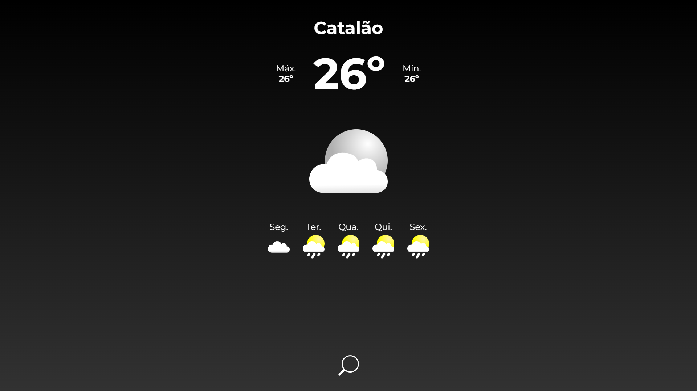

# Weather App

Este é um projeto de um aplicativo de clima proposto pelo site [The Odin Project](https://www.theodinproject.com/) para fixar o aprendizado sobre requisições de dados de API de terceiros. O aplicativo foi escrito em TypeScript, SASS e emprega o Webpack para compilação e empacotamento. O projeto está online em [diego-moreira8.github.io/weather-app](https://diego-moreira8.github.io/weather-app/).



## Funcionalidades

- Mostra o clima atual baseado na localização do usuário ou por meio de uma busca pelo nome da cidade.
- Apresenta uma previsão para os próximos 5 dias.
- Utiliza dados da API do OpenWeather para obter informações precisas sobre o clima.

## Como Executar

1. **Clone o repositório:**

```bash
git clone https://github.com/Diego-Moreira8/weather-app.git
```

2. **Instale as dependências:**

```bash
cd weather-app
npm install
```

3. **Execute o aplicativo:**

```bash
npm start
```

Isso iniciará um servidor de desenvolvimento local e abrirá o aplicativo no seu navegador padrão.

4. **Compilar para produção:**

Se desejar compilar o aplicativo para produção, você pode usar o comando:

```bash
npm run build
```

Isso criará uma versão otimizada do aplicativo na pasta `dist/`.

---

_Nota: Este projeto é apenas para fins educacionais e de aprendizado. Não é recomendado para uso em produção sem considerar práticas de segurança adequadas._
